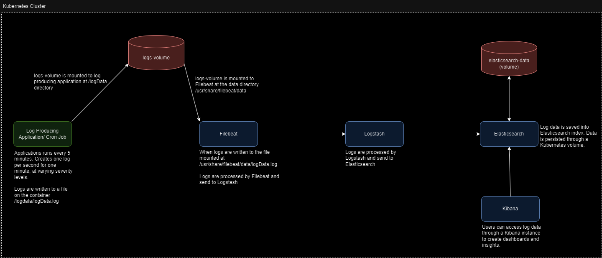

# elk-kubernetes
Elk Stack on Kubernetes for Docker

This repo contains needed resources to locally run a development ELK stack inside a local Kubernetes cluster.

## Architecture Diagram

## Software Needed

1. To install Kubernetes on a local machine: https://kubernetes.io/docs/tasks/tools/

2. Install Docker Desktop and run local Kubernetes Cluster
   1. Install from https://docs.docker.com/desktop/install/mac-install/ (there is a link for Windows or Linux on side bar of page)
   2. Once installed, find the settings tab
      1. Resource Tab - Set RAM to at least 8GB
      2. Kubernetes Tab - Enable Kubernetes
      3. Apply and Restart

3. Install helm for whatever operating system is being used
4. (Windows) If using Windows, install a bash system such as Git Bash or use PowerShell.

## Local Deployment

1. Modify files
    1. elk-deploy/elasticsearch/values.yaml
        - Need to modify esDataFolderPath to the folder where the Elasticsearch data will be stored locally
    2. elk-deploy/logs-volumes/values.yaml
        - Need to modify logsDataFolderPath to the folder where the log file data will be stored locally
    - NOTES: 
        - I routed to folders esdata and logdata in the elk-deploy folder for my development environment.
        - This is used for local development only. In a production environment the volumes would be backed by EBS or some other storage system, instead of using a local drive on a computer.    
2. Start Docker Desktop
3. Run deploy-elk-stack.sh located in elk-deploy
    - This script will build any needed docker images, and deploy all services to local kubernetes cluster 
    - If on Windows, I found it best to run the script on Git Bash, but Powershell will also work with some extra steps to download needed commands.
4. The last print in the script will say what port Kibana is running on. Navigate to the kibana url.
    - If the script has exited, you can check port number by using `kubectl get all` command and looking at service section for kibana
    - Navigate to localhost:\<port for kibana\>
5. After about 5 minutes, the log producing cronjob will have completed, and data will be available in the Kibana application to view and engage with.        

## Considerations for Production

If wanting to deploy to a production environment, here are some changes that would be helpful

1. Add security to ELK Stack
    - Obtain a license for Elasticsearch
    - Enable Xpack security features in ELK stack configurations
        - Each ELK service (elasticsearch, logstash, kibana) has a configuration file inside the respective  values.yaml files that can be modified to turn on security features
            - Current variables are
                - esConfig in elk-deploy/elasticsearch/values.yaml
                - logstashConfig in elk-deploy/logstash/values.yaml
                - kibanaConfig in elk-deploy/kibana/values.yaml
    - Would at a minimum add users and TLS
2. Volumes
    - The volumes on the local development version use the local volume Kubernetes type, so the volumes route to a folder on the local machine to store data
    - The volumes on a production environment would need to be a cloud block storage. Something similar to AWS EBS or EFS would work. 
        - Files that would be modified
            - elk-deploy/elasticsearch/templates/elastic-pv
            - elk-deploy/logs-volume/templates/logs-pv
        - Would change from local driver to some other type of driver depending on storage being utilized